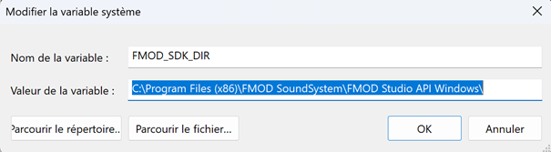
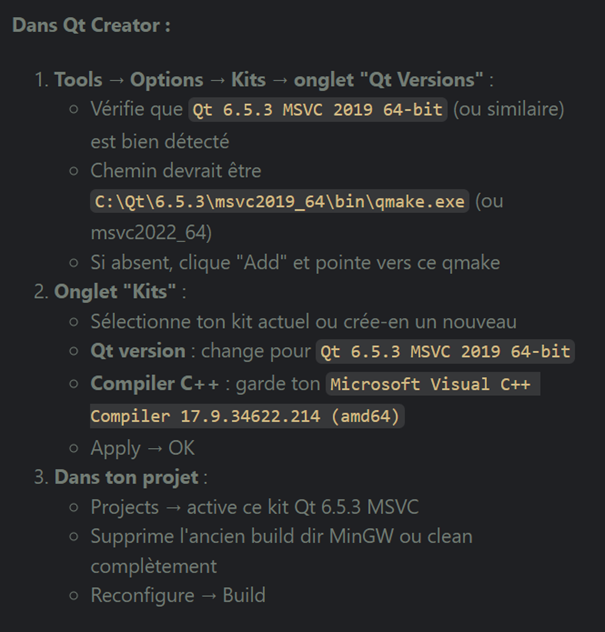

# Architecture du dossier
## 010 - rapport final et annexes
Contient le rapport de projet, le journal de travail et le cahier des charges.
Contient aussi les annexes, comme le guide d'installation de l'interface audio ou les schémas.

## 020 - Presentations
Contient la présentation et le contenu nécessaire pour la démo.

## 030 - Developpement
Ce dossier est regroupé en plusieurs dossiers, numérotés par ordre d'exécution.
Il contient une configuration 4.0 avec le logiciel FMOD.

### 0_sonos_apis
Dossier contenant tous les scripts Python utilisés relatifs aux enceintes Sonos (lecture simultanée, lecture individuelle, deux par deux, etc.)

### 1_python_carte_son
Contient les fichiers utilisant deux sorties en stéréo.

### 2_unreal_carte_son
Contient des essais avec le moteur de jeu Unreal Engine qui n'ont pas abouti, par manque de temps.

### 3_cpp_carte_son
Code C++ utilisant FMOD Studio API.
Contient des tests en stéréo des deux sorties spécifiques à l'interface audio (1r/1l et 2r/2l).
Contient également le contrôle des quatre sorties en simultané. (voir 0_4_outputs.cpp)

A noter que le code est adaté à l'interface audio Steinberg UR44C: il sera certainement nécessaire de changer de drivers et de numéros de ports en cas de changement de configuration.
### 4_demo_interactive
Application Qt se basant sur l'ancien code et qui fournit une interface graphique supplémentaire pour contrôler directement les quatre haut-parleurs en configuration 4.0. Une illusion de mouvemement sera crée.

**IMPORTANT:** Le nom du projet, stocké dans ce dossier, est trop long! Le dossier build génèrera une erreur. Il faut le copier-coller dans un autre dossier, comme par exemple `C:\dev\0_P3`.

Voici les directives utilisées pour utiliser **FMOD Studio API**:

* Installer FMOD Studio API.
* Ajouter la variable d'environnement

* Adapter le CMakeLists (voir 4_demo_interactive).

* Dans Qt, choisir un kit Qt Creator compatible FMOD. Voilà les informations (Copilot) suivies pour réussir à installer un kit sur Qt Creator:
* 
* Vérifier la détection FMOD dans la sortie de configuration : CMake doit trouver fmod.hpp et fmod_vc/fmodL_vc dans api/core/lib/x64 et copier la DLL vers le dossier binaire après build.
* Construire puis lancer depuis Qt Creator (Ctrl+B puis Ctrl+R). En Debug, la DLL utilisée est fmodL.dll, en Release fmod.dll (copiées automatiquement).
* Si CMake échoue sur FMOD introuvable : assurez-vous que FMOD_SDK_DIR pointe bien vers le SDK, que le kit est x64, et que le dossier “api/core/inc” contient fmod.hpp.